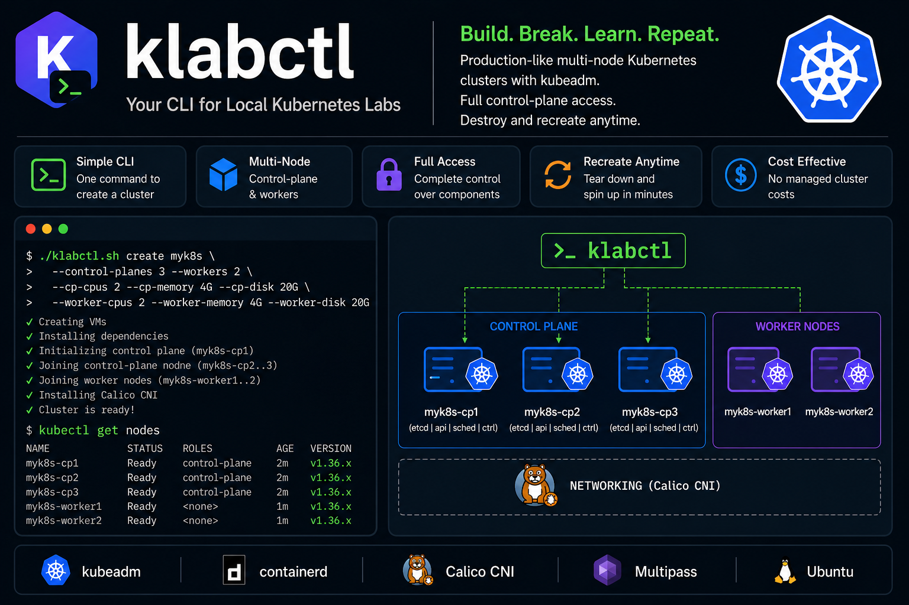

# klabctl

Production-like multi-node Kubernetes cluster on Multipass using kubeadm. Full control-plane access for learning, debugging, and experimentation without managed cluster cost.



Project CLI: `./klabctl.sh`

## Prerequisites

- Ubuntu 26.04 (or similar)
- KVM enabled
- `kubectl` installed on host (required for host-side commands like `kubectl get nodes`)
  - Install docs: [Install and Set Up kubectl on Linux](https://kubernetes.io/docs/tasks/tools/install-kubectl-linux/)
- Default baseline (recommended starting point):
  - ~4 vCPU
  - ~10-12 GB RAM free
  - ~20 GB disk minimum (40 GB preferred)
  - Typical per-node sizing: `2 CPU / 4G RAM / 10G disk` for both control-plane and worker nodes
  - Default create profile: `--control-planes 1 --workers 1`
- Recommended for stable HA/workloads (with per-node sizing):
  - ~8+ vCPU
  - ~16+ GB RAM free
  - ~100 GB disk
  - Typical per-node sizing: `2 CPU / 4G RAM / 20G disk` for both control-plane and worker nodes
  - Recommended create profile: `--control-planes 3 --workers 2` (and increase per-node resources as needed)

References:
- [Multipass Requirements](https://documentation.ubuntu.com/multipass/latest/explanation/requirements/)
- [How to check KVM support (Ubuntu docs)](https://help.ubuntu.com/community/KVM/Installation)

## Quick Start

### Step 1: Install Multipass (requires sudo, run manually)

```bash
sudo snap install multipass
```

Official install docs (recommended to verify latest instructions):
- [Multipass Installation Guide](https://documentation.ubuntu.com/multipass/latest/how-to-guides/install-multipass/)

Verify:

```bash
multipass version
```

### Step 2: Create VMs and bootstrap cluster

```bash
# Make script executable
chmod +x klabctl.sh

# Create default cluster "k8s"
./klabctl.sh create k8s

# Or create a custom cluster (VM names start with this prefix)
./klabctl.sh create <cluster-name>

# Minimum node counts
./klabctl.sh create <cluster-name> --control-planes 1 --workers 1

# Default baseline profile (matches prerequisites above)
./klabctl.sh create <cluster-name> \
  --control-planes 1 --workers 1 \
  --cp-cpus 2 --cp-memory 4G --cp-disk 10G \
  --worker-cpus 2 --worker-memory 4G --worker-disk 10G

# Recommended HA/workload profile (values below are per node, not cluster totals)
./klabctl.sh create <cluster-name> \
  --control-planes 3 --workers 2 \
  --cp-cpus 2 --cp-memory 4G --cp-disk 20G \
  --worker-cpus 2 --worker-memory 4G --worker-disk 20G
```

`klabctl.sh create` prints estimated total vCPU/RAM for the requested node counts and asks for confirmation before creating VMs.
Control-plane and worker per-node resources can be increased at create time using `--cp-*` and `--worker-*` flags.
`create` currently installs Kubernetes `v1.36`.

### Create Options

`cp` means **control-plane**.

- `--control-planes N`: number of control-plane nodes (min: `1`)
- `--workers N`: number of worker nodes (min: `1`)
- `--cp-cpus N`: vCPUs per control-plane node (min: `2`)
- `--cp-memory SIZE`: RAM per control-plane node (min: `1700M`, examples: `4G`, `4096MB`)
- `--cp-disk SIZE`: disk per control-plane node (example: `10G`, `30G`)
- `--worker-cpus N`: vCPUs per worker node (min: `1`)
- `--worker-memory SIZE`: RAM per worker node (min: `1700M`, examples: `4G`, `4096MB`)
- `--worker-disk SIZE`: disk per worker node (example: `10G`, `30G`)

### Cluster Management CLI

```bash
# List clusters created via klabctl naming convention
./klabctl.sh list

# Create a specific cluster
./klabctl.sh create <cluster-name> --control-planes 3 --workers 2

# Start / stop a specific cluster
./klabctl.sh start <cluster-name>
./klabctl.sh stop <cluster-name>
./klabctl.sh refresh <cluster-name>

# Delete one specific cluster
./klabctl.sh delete <cluster-name>

# Non-interactive delete + purge deleted instances
./klabctl.sh delete <cluster-name> --yes --purge
```

`delete` also removes that cluster's context/cluster/user entries from `~/.kube/config` (if present).

`klabctl.sh create` will:

1. Create VMs with prefix `<cluster-name>`:
   `<cluster-name>-cp1..N` and `<cluster-name>-worker1..N`
2. Install containerd, kubeadm, kubelet, kubectl on all nodes
3. Initialize the control plane on `<cluster-name>-cp1`
4. Join additional control-plane nodes (`<cluster-name>-cp2..N`)
5. Join worker nodes (`<cluster-name>-worker1..N`)
6. Install Calico CNI
7. Generate `kubeconfig-<cluster-name>.yaml` for host access

By default, cluster creation parallelizes package installation and node joins (after `<cluster-name>-cp1` is initialized); VM launch is intentionally sequential for stability.

### Step 3: Use the cluster

```bash
# After a successful create, klabctl already:
# 1) creates kubeconfig-<cluster-name>.yaml
# 2) merges it into ~/.kube/config
# 3) switches current context to <cluster-name>

kubectl get nodes

# Open shell to default control-plane node (<cluster-name>-cp1)
./klabctl.sh shell <cluster-name>

# Open shell to a specific non-default node
./klabctl.sh shell <cluster-name> <cluster-name>-worker1
```

## Manual Steps (if cluster create fails)

Manual setup guide is not added yet. Prefer re-running `./klabctl.sh create <cluster-name>` after fixing the failing step.

## Default VM Specs

| Node Pattern             | Role          | RAM  | CPU | Disk  |
|--------------------------|---------------|------|-----|-------|
| `<cluster>-cp1..N`       | control-plane | 4G | 2 | 10G |
| `<cluster>-worker1..N`   | worker        | 4G | 2 | 10G |

Node counts are user-defined via `--control-planes` and `--workers` (minimum `1` each).
You can increase per-node sizing with `--cp-cpus`, `--cp-memory`, `--cp-disk`, `--worker-cpus`, `--worker-memory`, and `--worker-disk`.

## Useful Commands

```bash
# List VMs (all clusters)
./klabctl.sh nodes

# List VMs for one cluster only
./klabctl.sh nodes <cluster-name>

# Shell into a node (defaults to ${CLUSTER_NAME}-cp1)
./klabctl.sh shell <cluster-name>

# Shell into a specific node
./klabctl.sh shell <cluster-name> <cluster-name>-worker1

# Delete cluster (destructive; removes all cp/worker nodes for this cluster)
./klabctl.sh delete <cluster-name> --yes --purge

# Refresh kubeconfig and hosts after VM restart (IPs may change)
./klabctl.sh refresh <cluster-name>
```

